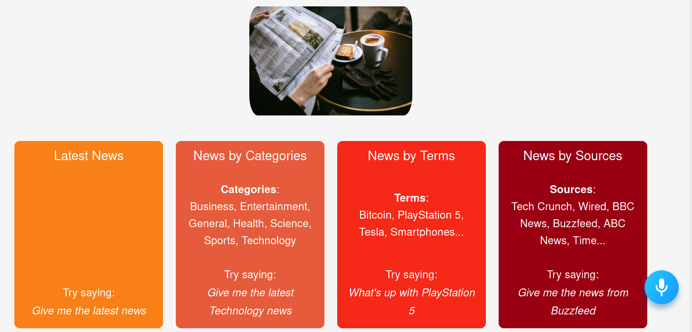

# **Voice Controlled React News Application - Alan AI Voice Assistant**

## Introduction

_Voice enabled news reader app built using react with voice assistance by ALAN AI._

Alan AI is a revolutionary speech recognition software that allows you to add voice capabilities to your applications. It allows you to control absolutely everything in the app using your voice. Another huge benefit is that it's extremely easy to integrate it. Setup:

* run 'npm start' to start development server
